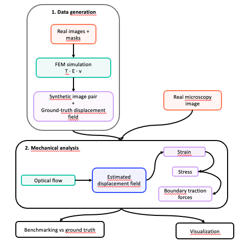
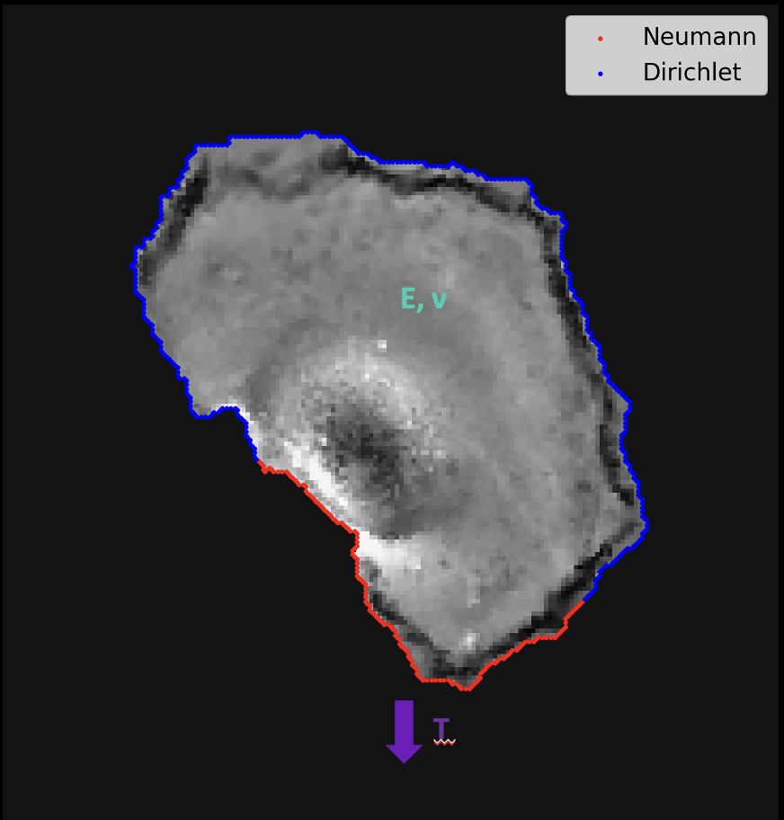

# Hessian Regularized Optical Flow for Mechanobiology

This repository provides a pipeline to **simulate** micropipette aspiration experiments on elastic cells and **analyze** the resulting images using multiple optical flow algorithms, estimating key mechanical quantities: displacement, strain, stress, and traction forces.

The main goal is to **benchmark** optical flow methods for cell mechanics — identifying which performs best under varying noise levels and mechanical parameters. Real microscopy images can also be processed, though no ground truth comparison is available in that case.

## Table of Contents
- [Overview](#overview)
- [Installation](#installation)
- [Data Generation](#data-generation)
- [Optical Flow and Mechanical Analysis](#optical-flow-and-mechanical-analysis)

---

## Overview

The repository is divided into two main parts:

**1. Data generation** — Generates synthetic images of deformed elastic cells using FEniCSx (finite element simulation).

> [!NOTE]
> FEniCSx is computationally heavy. Pre-generated datasets are available at [link].

**2. Mechanical analysis** — Runs multiple optical flow algorithms on the images, computes derived mechanical quantities, and benchmarks the results.

> [!TIP]
> You can either run the **full pipeline** (generation + analysis) or skip data generation and use **pre-generated data** directly.

<p align="center">
  
</p>

---

## Installation

Start by cloning the repository:

```bash
git clone git@github.com/bia-pasteur/ofmeca.git
```

### Option A — Full pipeline

Create a conda environment with Python 3.12 and install FEniCSx:

```bash
conda install -c conda-forge fenics-dolfinx
```

Install all requirements:

```bash
pip install -r requirements.txt
```

Then run the full pipeline:

```bash
./run_all.sh
```

### Option B — Analysis only (pre-generated data)

> [!TIP]
> Download the pre-generated dataset from [link] and place it under `data/`.

Install analysis requirements only:

```bash
pip install -r mechanics/requirements.txt
```

---

## Data Generation

> [!NOTE]
> Skip this section if you are using the pre-generated datasets.

Install the data generation requirements:

```bash
conda install -c conda-forge fenics-dolfinx
pip install -r data_generation/requirements.txt
```

We provide real cell images at `img_paths` and segmentation masks at `masks_paths`. These are used as an initial position of a cell that will be deformed using the Finite Elements Methods. The images currently used are from the Cell Tracking Challenge dataset `Glioblastoma-astrocytoma U373 cells on a polyacrylamide substrate` provided by Dr S. Kumar., Department of Bioengineering, University of California at Berkeley, Berkeley CA (USA).

### Elastic experiments

We fix mechanical parameters `T`, `E`, `ν` on a synthetic image. 

<p align="center">
  
</p>


Three experiments are available, each varying one mechanical parameter while keeping the others fixed:

| Experiment | Variable | Fixed parameters | YAML keys |
|------------|----------|------------------|-----------|
| 1 | Traction `T` | E, ν | `traction_zone`, `ym_for_t_nu`, `nu_for_t_ym` |
| 2 | Young's modulus `E` | T, ν | `youngs_modulus`, `t_for_ym_nu`, `nu_for_t_ym` |
| 3 | Poisson's ratio `ν` | T, E | `nu`, `t_for_ym_nu`, `ym_for_t_nu` |

Each experiment is repeated for all cells in the provided image. Generate the images with:

```bash
python -m data_generation.examples.generate_elastic_datasets \
  --config=data_generation/configs/elastic_params.yaml
```

Images and ground truth displacements are saved under `data/elas/experiment_i/T_<T>_E_<E>_nu_<nu>/`

### Noise experiments

To test robustness to noise, Gaussian noise of increasing standard deviations (defined by `noise_stds`) is added to reference images. The reference images are selected via `traction_zone`, `ym`, and `nu` in `noise_params.yaml`.

Generate noisy images with:

```bash
python -m data_generation.examples.generate_noisy_elastic_datasets \
  --config=data_generation/configs/noise_params.yaml
```

Images and displacements are saved under:

```
data/noise_experiment_T_<T>_E_<E>_nu_<nu>/img_<seed>/
```

---

## Optical Flow and Mechanical Analysis

Install requirements:

```bash
pip install -r mechanics/requirements.txt
```

### Synthetic images

#### Configuration

Edit the relevant config files before running:

- **`mechanics/configs/elastic_exp.yaml`** — standard experiments
  - `of_funcs`: list of optical flow algorithms to test
  - Select specific images via `T`, `E`, `nu`, `image_id`, or a whole experiment via `exp_ind` (leave unspecified to run all)
  - `T_for_plot`, `E_for_plot`, `nu_for_plot`, `implot`: select which image to visualize

- **`mechanics/configs/noise_exp.yaml`** — noise robustness experiments

- **`mechanics/configs/reg_exp.yaml`** — regularization experiments
  - `T`, `E`, `nu`, `factors`: control the regularization study

Results are stored under `results/tables/` and `results/plots/`.

#### Running the scripts

| Purpose | Command | Output |
|---------|---------|--------|
| Standard experiments | `python -m mechanics.examples.run_elastic_exp --config=mechanics/configs/optical_flow.yaml --config=mechanics/configs/general.yaml --config=mechanics/configs/elastic_exp.yaml` | RMSE tables + plots |
| Noise robustness | `python -m mechanics.examples.run_elastic_noise --config=mechanics/configs/optical_flow.yaml --config=mechanics/configs/general.yaml --config=mechanics/configs/noise_exp.yaml` | Combined plot |
| Regularization robustness | `python -m mechanics.examples.run_elastic_reg --config=mechanics/configs/optical_flow.yaml --config=mechanics/configs/general.yaml --config=mechanics/configs/reg_exp.yaml` | Saved results + plots |
| Noise + regularization | `python -m mechanics.examples.run_elastic_noise_reg --config=mechanics/configs/optical_flow.yaml --config=mechanics/configs/general.yaml --config=mechanics/configs/reg_exp.yaml` | Saved results + plots |

### Microscopy images

#### Configuration

Edit `mechanics/configs/micro_exp.yaml`:

- `of_funcs`: optical flow algorithms to apply
- `path`: path to the `.tif` image file
- Physical parameters and segmentation parameters for the analysis

> [!NOTE]
> Preprocessing steps (channel extraction, reshaping) are handled inside the `main` function of `run_micro_image_exp.py` and may need to be adapted to your image format.

Run the analysis with:

```bash
python -m mechanics.examples.run_micro_image_exp \
  --config=mechanics/configs/optical_flow.yaml \
  --config=mechanics/configs/general.yaml \
  --config=mechanics/configs/micro_exp.yaml
```

Results (plots) are stored under `results/plots/`.